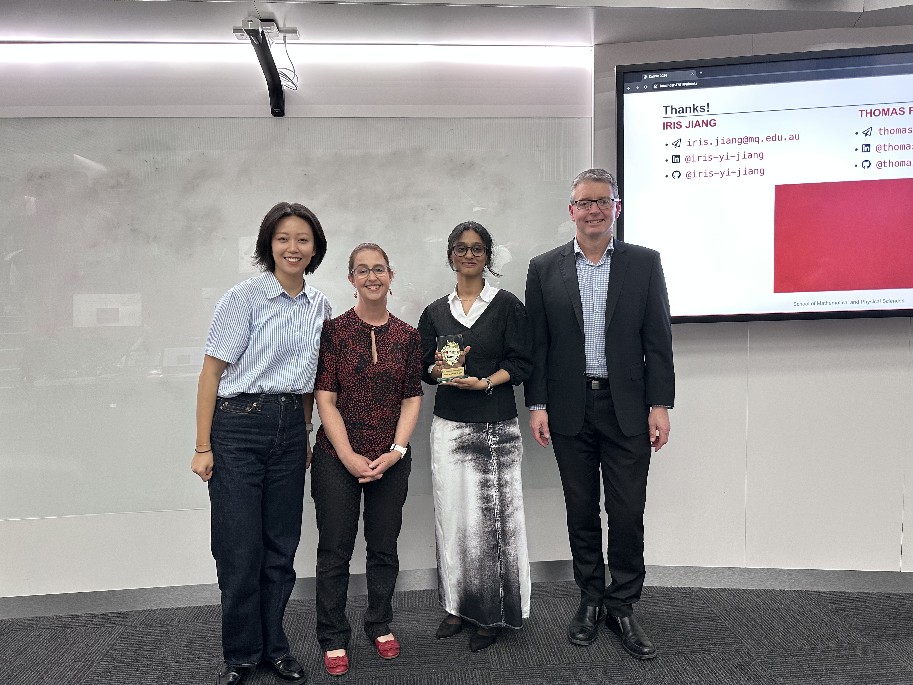
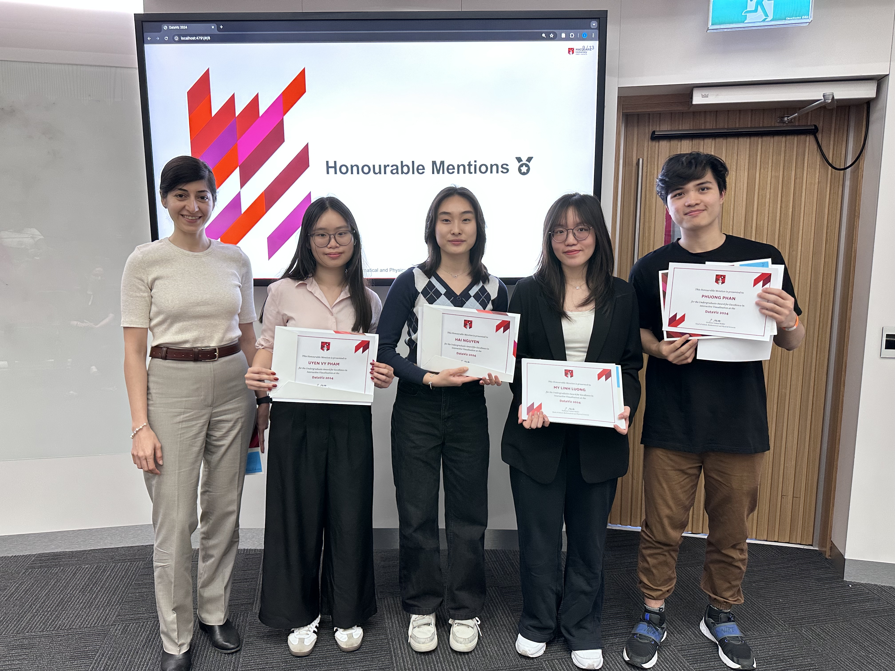
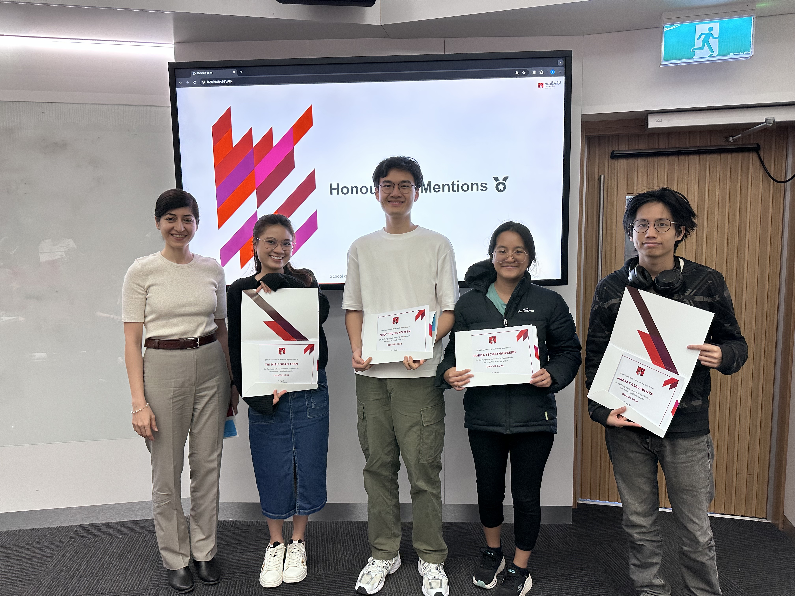
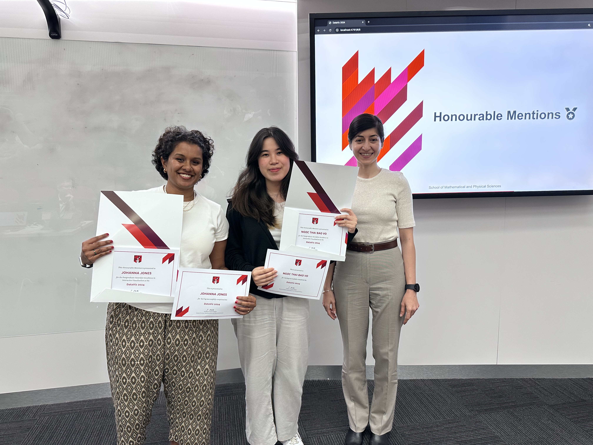
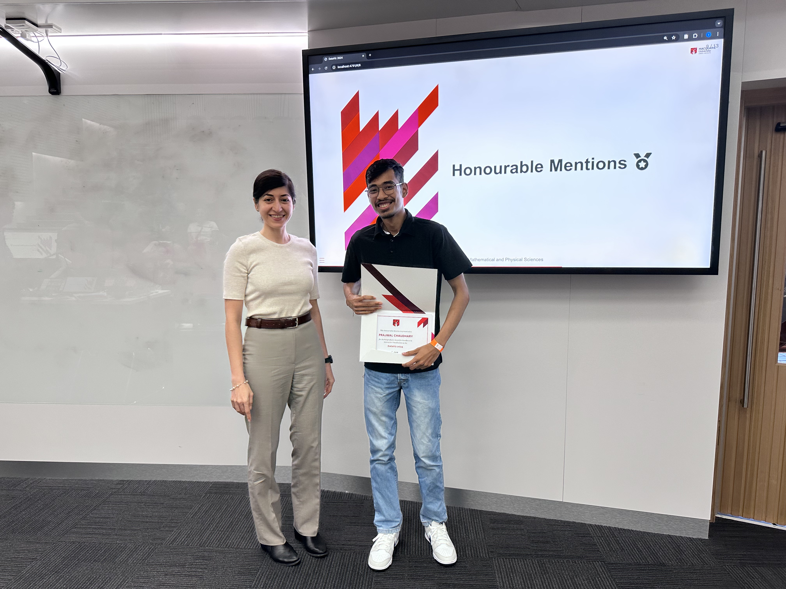
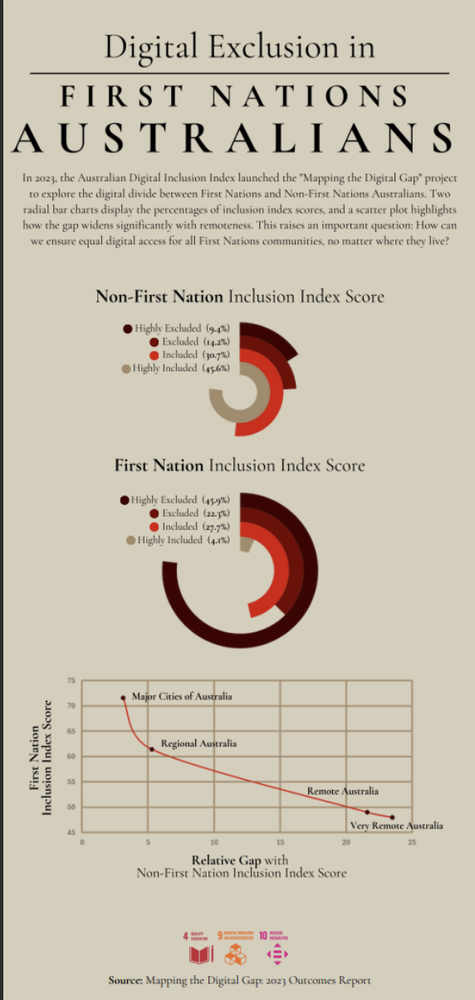

# 2024 Challenge

Using datasets suggested by the United Nations Datathon or any other publicly available datasets, create a static or interactive dashboard *with **ANY** of your favourite software/packages (Quarto, Shiny, Power BI, Tableau, Excel are just few such examples)* to tell a story or highlight key insights related to one of the following themes:

-   Climate Change (<https://unstats.un.org/wiki/label/UNDatathon2023/climate-change>)
-   Digital connectivity (<https://unstats.un.org/wiki/label/UNDatathon2023/digital-connectivity>)

We selected these themes due to their significant impact on achieving the United Nations Sustainable Development Goals (UN SDGs). Climate change is directly linked to Goal #13 (<https://sdgs.un.org/goals/goal13>), which affects the remaining SDGs. Digital connectivity has the potential to accelerate progress towards every single one of the 17 SDGs (<https://www.itu.int/en/mediacentre/backgrounders/Pages/icts-to-achieve-the-united-nations-sustainable-development-goals.aspx>).

# 2024 Winners 🏆

## Best Interactive Visualisation

{fig-align="center"}


::::: panel-tabset
## Winners

### Undergraduate Winner

-   Asma Asif Sayyad

::: {.callout-important collapse="true" appearance="default" icon="true"}
## Submission

```{=html}
<iframe width="780" height="500" src="https://app.powerbi.com/view?r=eyJrIjoiMjQzYzNkYWUtMzRmNC00NDQ0LWE5OTctMGUxYjY0Y2M4ZGFhIiwidCI6IjgyYzUxNGMxLWE3MTctNDA4Ny1iZTA2LWQ0MGQyMDcwYWQ1MiJ9" title="Best Interactive Visualisation (Undergraduate)"></iframe>
```

#### Entry Statement

The trends in this dashboard weave together a compelling narrative about the power of connectivity in shaping sustainable global progress. The upward trajectory of countries with higher internet penetration reveals a clear pattern: as more people gain digital access, national development accelerates. Countries with 80% or more of their population online consistently achieve SDG scores of 70 and above, signaling strong advancements in sectors like education, healthcare, and innovation. This trend demonstrates that connectivity is not just a technological tool, but a fundamental driver of development. The nations at the top of the chart, with high internet usage and high SDG scores, show that digital infrastructure supports a ripple effect of progress—linking directly to SDG 4 (Quality Education), SDG 8 (Decent Work and Economic Growth), SDG 9 (Industry, Innovation, and Infrastructure), and beyond. On the opposite end, the scatter of countries with low internet usage struggling to break past SDG scores of 50 tells a different story. It exposes a developmental divide, where limited connectivity stifles potential, hindering access to education, economic opportunities, and sustainable practices.

Together, these trends craft a vivid narrative: internet connectivity is the bridge between underdeveloped nations and a future of sustainable progress. Without it, the digital divide becomes a developmental divide, leaving many behind.
:::

### Postgradaute Winner

-   Do Nam Phong Phung
-   Cao Thuc Ta
-   Anh Duc Nguyen
-   Viet Anh Nguyen

::: {.callout-important collapse="true" appearance="default" icon="true"}
## Submission

```{=html}
<iframe width="780" height="500" src="https://macquarie-dataviz24-sdg-dashboard.onrender.com" title="Best Interactive Visualisation (Postgradaute)"></iframe>
```

### Entry Statement

Our dashboard illustrates the effects of climate-related disasters globally. The dashboard presents essential indicators, including total fatalities, impacted populations, and economic losses, enabling governments, organisations, and communities to pinpoint the places most vulnerable to catastrophes. It offers insights on the impact of extreme weather events such as floods, storms, and droughts on various regions globally, enabling decision-makers to enhance disaster preparedness and resilience initiatives. The dashboard further emphasises patterns and trends over time, allowing users to monitor the frequency and intensity of severe weather occurrences. These insights are essential for risk reduction and resource allocation, guaranteeing that the most vulnerable populations have the necessary assistance. Our dashboard equips decision-makers with data-driven insights, facilitating a deeper understanding of and response to the escalating effects of climate change, therefore advancing the overarching targets of SDG 13.
:::

## Honourable mentions

### Undergradaute

- My Linh Luong
- Uyen Vy Pham
- Wanying Wang
- Nguyen Nhat Phuong Phan
- Phuc Nhu Hai Nguyen
- Sabrina Kfoury

{fig-align="center"}

### Postgraduate

-   Thi Hieu Ngan Tran
-   Quoc Trung Nguyen
-   Panida Techathaweerit
-   Jirapat Asavabenya
-   Panida Techathaweerit
-   Johanna Jones
-   Ngoc Thai Bao Vo
-   Prajwal Chaudhary

{fig-align="center"}

{fig-align="center"}

{fig-align="center"}
:::::

## Best Static Visualisation

{fig-align="center"}

### Undergraduate Winner

-   Denver Sutandya
-   Radhika Valanju
-   Hannah Guo
-   Angus Stewart

::: {.callout-important collapse="true" appearance="default" icon="true"}
## Submission

```{=html}
<iframe width="780" height="500" src="https://provokedpanda.quarto.pub/dataviz-2024/" title="Best Static Visualisation (Undergraduate)"></iframe>
```

#### Entry Statement

Digital connectivity has the potential to accelerate progress towards every single other UN SDG, highlighting the importance of how each country's connectivity levels compare with both international peers and within its own borders.

Our research found that average connectivity for each school age in the analysed countries was less than 38%, particularly in regions such as the Middle East and North Africa (MENA) and South Asia (SA). Within each region, the disparities between the richest and poorest were considerably high but less so between rural and urban residents.

We also found that the differences in rural and urban connectivity were more substantial for lower- and upper-middle-income countries, while differences between the richest and poorest were higher in upper-middle-income and high-income countries. For some countries, small disparities were simply because almost nobody was well-connected digitally in the first place.

Overall, digital connectivity levels are lowest in MENA and SA, while connectivity inequality is generally higher due to income disparities rather than geographic differences. To address this, countries will need to improve their infrastructure and address growing wealth inequality to ensure they can faster attain the UN SDGs.
:::

### Postgraduate Winner

-   Enrico Lorenzo Martinez Santos

::: {.callout-important collapse="true" appearance="default" icon="true"}
## Submission

{fig-align="center"}

#### Entry Statement

As an immigrant to this country, I find it deeply unsettling that while many come to Australia to contribute to the development of this land, First Nations people are often left behind when it comes to access to technology. Despite the advances made across the country, a growing digital divide continues to mirror broader social injustices. Many First Nations people, especially those living in remote communities, face significant barriers to accessing the digital tools much of Australia takes for granted. This issue is rooted in a history of exclusion and inequality. Digital inclusion is more than just access to the internet. It’s about empowerment, education, and opportunity. It addresses the disparity in access to essential resources, aligning with the Sustainable Development Goals related to education, infrastructure, and reducing inequalities.

While the world rapidly evolves through new technology, many in First Nations communities are left behind. The digital divide is a modern reflection of broader systemic inequities, and without change, we risk perpetuating a future where technological advancement deepens the divide rather than bridging it. How can we truly progress as a society if entire communities are left disconnected from the opportunities digital inclusion offers?
:::

# Important dates 2024 🚨

|                                             |                       |
|---------------------------------------------|-----------------------|
| Thursday 12 September                       | Challenge Launches    |
| Friday 27 September & Saturday 28 September | Dashboard Masterclass |
| Sunday 20 October, 23:55pm (ADST)           | Entry Deadline        |
| Wednesday 30 October                        | All Winners Announced |

# How to Enter 🎫

1.  Register at <https://mqedu.qualtrics.com/jfe/form/SV_1TcpY3kDpGZJRno>.
    -   This includes your RSVP to the Dashboard Masterclass.
2.  Complete your visualisation.
3.  Submit your visualisation to [iris.jiang\@mq.edu.au](mailto:iris.jiang@mq.edu.au) by **Sunday 20 October, 23:55pm (ADST)**. Your message should have a subject line `DataViz 2024 Entry` and include a short paragraph (max. 200 words) describing the story you intended to tell.

# Acknowledgement

This event is supported by the Faculty of Science & Engineering (FSE) Teaching Development Grant in 2024.