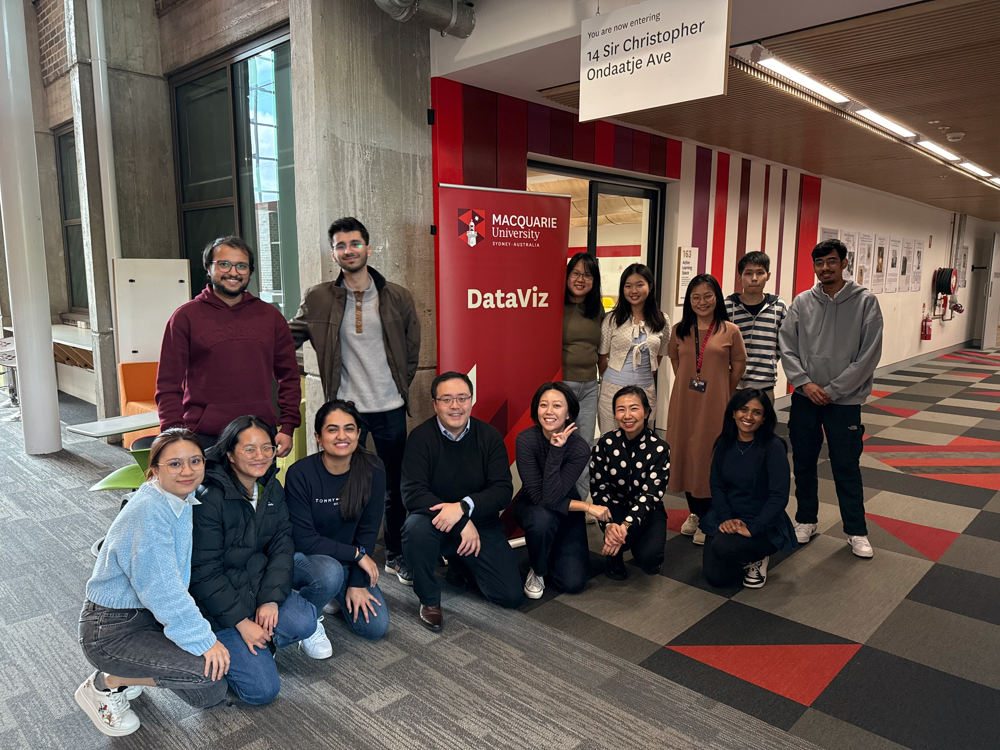

# Unlock Your Data Storytelling Potential with the inaugural DataViz Challenge! 💪

Join us for DataViz, an exciting initiative from **School of Mathematical & Physical Sciences** of Macquarie University — a data visualisation challenge designed to showcase your ability to tackle real-world sustainability challenges through analytical thinking, creative visualisation, and compelling storytelling. **You can participate individually or in teams of up to 5 students. The challenge is open to all current Macquarie University students**.

{fig-align="center"}

# Important dates 2025 🚨

|                                             |                       |
|---------------------------------------------|-----------------------|
| Monday 8 September                       | Challenge Launches    |
| Tuesday 23 September           | Registration Deadline        |
| Thurdsay 25 September & Friday 26 September | Dashboard Masterclass |
| __Monday 27 October, 9:00am (ADST)__           | __Entry Deadline__        |
| Monday 3 November                        | All Winners Announced |
| Week 13, TBD                        | Showcase & Award Ceremony |

# How to Enter 🎫

1. Register at <https://mqedu.qualtrics.com/jfe/form/SV_8IDFaeAnN29KLxI>. 
    - This includes your RSVP to the Dashboard Masterclass.
2. Complete your visualisation.
3. DataViz participants will be added to dedicated community iLearn page for `DataViz 2025`. You or your team can then submit the visualisation along with a short paragraph (max. 200 words) describing the story you intended to tell. We encourage you to be creative and showcase your insights! Submissions are due by __Monday 27 October, 9:00am (ADST)__. 

# 2025 Challenge

Using datasets suggested by the United Nations Datathon or any other publicly available datasets, create a static or interactive dashboard _with **ANY** of your favourite software/packages (Quarto, Shiny, Power BI, Tableau, Excel are just few such examples)_ to tell a story or highlight key insights related to one of the following themes:

-   Biodiversity loss (<https://unstats.un.org/wiki/label/UNDatathon2023/biodiversity-loss>) and pollution  (<https://unstats.un.org/wiki/label/UNDatathon2023/pollution>)
-   Energy access and affordability (<https://unstats.un.org/wiki/label/UNDatathon2023/energy>)

We selected these themes due to their profound relevance to achieving the United Nations Sustainable Development Goals (UN SDGs). Biodiversity loss and pollution are directly linked to Goal #15 (Life on Land) and Goal #14 (Life Below Water), as well as Goal #12 (Responsible Consumption and Production), given the critical challenges posed by ecosystem degradation, waste, and environmental contaminants. Addressing biodiversity loss and pollution is essential, as they have cascading impacts on food security, human health, and the resilience of natural systems that underpin all SDGs.

Energy access and affordability is strongly connected to Goal #7 (Affordable and Clean Energy) and underpins progress on multiple goals, including poverty reduction (Goal #1), economic growth (Goal #8), and climate action (Goal #13). Ensuring equitable access to sustainable energy is a cornerstone for inclusive development, particularly as societies transition towards low-carbon futures.

Together, these themes reflect urgent global challenges and highlight the interconnected nature of the SDGs, reinforcing the importance of integrated solutions for a sustainable future.

You can find the winning 2024 entries [here](dataviz2024.html).

# Why focus on the UN SDGs?

Because it is a fantastic opportunity for you to demonstrate that you are prepared to tackle the complexities and challenges facing today’s society.

# Categories and Prizes 🏆

There is a chance to win amazing prizes in two categories:

-   Best Static Visualisation
-   Best Interactive Visualisation

Prizes will be awarded at both undergraduate and postgraduate levels. To qualify for the postgraduate category, your team must include at least one postgraduate student.

# Judging Criteria

Our expert judging panel will evaluate entries based on:

-   The story told and insights offered on the chosen theme. Bonus point for linking your story/insights to UN SDG(s).

-   Creativity and aesthetic appeal

-   Effective communication

If we receive enough high-quality entries, we will host a town-hall style ceremony where you or your team can present your masterpiece to the wider university community.

# New to dashboard? No worries. We got you covered.

Over two fully catered days on 25 & 26 September 2025, you'll dive into hands-on masterclass to learn how to create dashboards with Quarto (<https://quarto.org/docs/dashboards/>) and Shiny (<https://shiny.posit.co>). *You may be able to earn 20 points towards the Global Leadership Program (GLP) (to be confirmed)*.

We assume you can already analyse and summarise your data in computational notebooks with R and/or Python. This masterclass will then enable you to share your insights or allow others to make their own conclusions in visually appealing dashboards.

For catering purposes, please register to the workshop when you register for DataViz 2025: <https://mqedu.qualtrics.com/jfe/form/SV_8IDFaeAnN29KLxI>.

You can find out more about this masterclass [here](workshop.html).

# In summary

Don't miss this opportunity to enhance your skills, expand your `LinkedIn` profile, collect unique `R` hex stickers along the way, and make a difference -- register now for DataViz 2025!

# Acknowledgement

This event is supported by the Faculty of Science & Engineering (FSE). 

Iris Jiang and Thomas Fung

Organisers of DataViz
